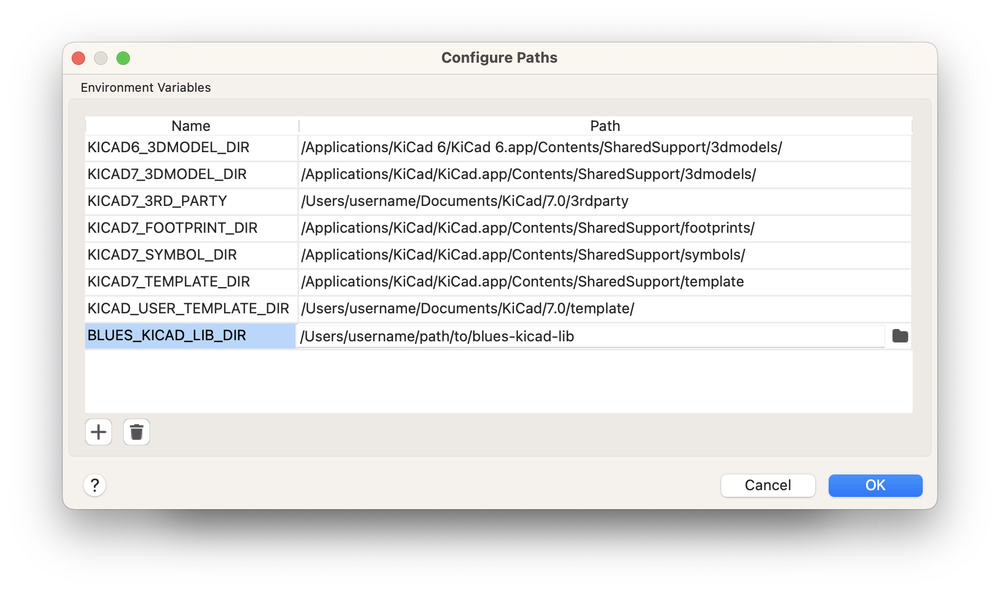

# blues-kicad-lib

A library of symbols, footprints and 3D models for use in KiCad, by Blues Inc.

**Important:** to use this library, you must add an environment variable to KiCad called `BLUES_KICAD_LIB_DIR`, set to the location of your installation of this library. In KiCad, go to the "Preferences" menu and choose "Configure Paths..." to configure environment variables.

## Description

The library currently consists of:

- a single symbol library: `blues-kicad-lib.kicad_sym`
- a single footprint library: `blues-kicad-lib.pretty`
- and a single folder of 3D models: `3d-models`

### Symbol Library

The symbol library contains both generic (eg. `L_Shielded`) and specific (eg. `MAX17225ELT`) parts. All symbols specify default values for the `Reference`, `Value`, `Description` and `Keywords` fields.

Specific parts may also include a datasheet link and a footprint link. Datasheet links are URLs, while footprint links can either reference a footprint in the KiCad system library (eg. `Package_DFN_QFN:DFN-8-1EP_3x2mm_P0.5mm_EP1.75x1.45mm`) or one in the `blues-kicad-lib` itself (eg. `blues-kicad-lib:TO277-3`).

No other fields are specified, allowing convenience and flexibility for the designer to meet their project needs.

### Footprint Library

The footprint library generic (eg. `CS-C-0402`) and specific (eg. `MAX17225ELT`) footprints. They are named according to the convention of their origin (eg. `CS-C-0402` is the name used in the source OrCAD project).

If a footprint is for a part with a representative physical form (eg. it is a footprint for a specific part, or generic parts that have mostly the same physical form) it should have at least one corresponding 3D model set. The model can be from the KiCad system library or the `blues-kicad-lib` library itself.

Since the library can be installed anywhere, to link to a 3D model the path must be specified **relative to an environment variable**. For example `${KICAD7_3DMODEL_DIR}/Battery.3dshapes/BatteryHolder_Bulgin_BX0036_1xC.wrl` or `${BLUES_KICAD_LIB_DIR}/3d-models/XFBGA8.step`. This is why the `BLUES_KICAD_LIB_DIR` environment variable is required to use this library - unlike symbols and footprints, 3D models are not copied into the project when they are used, due to their size and binary content. Thus, an absolute path is required to maintain the link. Making it a single environment variable that points at the root of the library makes it easy and robust for users of the library.

For more information on the reason, alternative strategies, and potential futures for the absolute path to 3D models, see [here](https://gitlab.com/kicad/code/kicad/-/issues/2073).

### 3D Models

Representative 3D models of the bodies of parts are storied in the `3d-models` directory. STEP file format is preferred, since they can be included in a 3D export of the board assembly. If available, a file with the same base name but in WRL format can also be included, to allow nicer renderings within KiCad.

The directory name must remain `3d-models` to ensure the links to footprints stay intact, as described in the *Footprint Library* section. For discoverability, each 3D model ought to be linked to at least one footprint.
