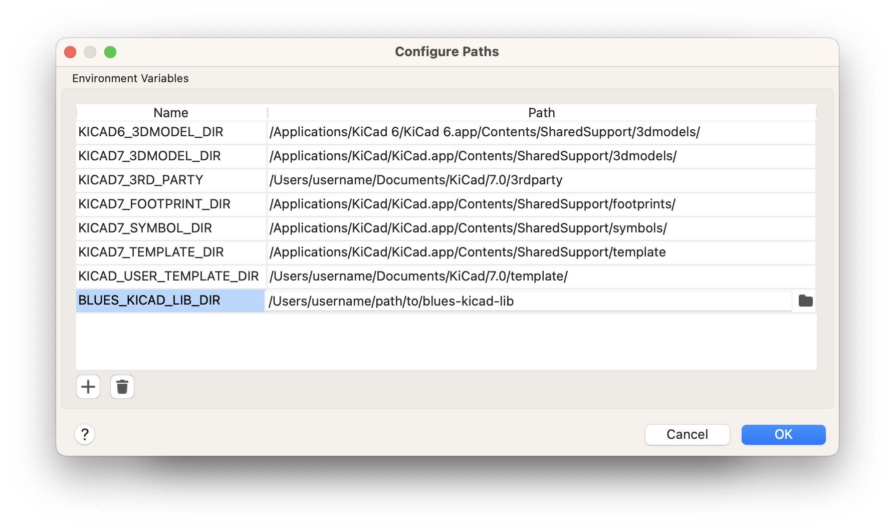

# blues-kicad-lib

A library of symbols, footprints and 3D models for use in KiCad, by Blues Inc.

**Important:** to use this library, you must add an environment variable to KiCad called `BLUES_KICAD_LIB_DIR`, set to the location of your installation of this library. In KiCad, go to the "Preferences" menu and choose "Configure Paths..." to configure environment variables.



## Description

The library currently consists of:

- a single symbol library: `blues-kicad-lib.kicad_sym`
- a single footprint library: `blues-kicad-lib.pretty`
- and a single folder of 3D models: `3d-models`

### Symbol Library

The symbol library contains both generic (eg. `L_Shielded`) and specific (eg. `MAX17225ELT`) parts. All symbols specify default values for the `Reference`, `Value`, `Description` and `Keywords` fields.

Specific parts may also include a datasheet link and a footprint link. Datasheet links are URLs, while footprint links can either reference a footprint in the KiCad system library (eg. `Package_DFN_QFN:DFN-8-1EP_3x2mm_P0.5mm_EP1.75x1.45mm`) or one in the `blues-kicad-lib` itself (eg. `blues-kicad-lib:TO277-3`).

No other fields are specified, allowing convenience and flexibility for the designer to meet their project needs.

### Footprint Library

The footprint library contains generic (eg. `CS-C-0402`) and specific (eg. `MAX17225ELT`) footprints. They are named according to the convention of their origin (eg. `CS-C-0402` is the name used in the source OrCAD project).

If a footprint is for a part with a representative physical form (eg. it is a footprint for a specific part, or generic parts that have mostly the same physical form) it should have at least one corresponding 3D model set. The model can be from the KiCad system library or the `blues-kicad-lib` library itself.

Since the library can be installed anywhere, to link to a 3D model the path must be specified **relative to an environment variable**. For example `${KICAD7_3DMODEL_DIR}/Battery.3dshapes/BatteryHolder_Bulgin_BX0036_1xC.wrl` or `${BLUES_KICAD_LIB_DIR}/3d-models/XFBGA8.step`. This is why the `BLUES_KICAD_LIB_DIR` environment variable is required to use this library - unlike symbols and footprints, 3D models are not copied into the project when they are used, due to their size and binary content. Thus, an absolute path is required to maintain the link. Making it a single environment variable that points at the root of the library makes it easy and robust for users of the library.

For more information on the reason, alternative strategies, and potential futures for the absolute path to 3D models, see [here](https://gitlab.com/kicad/code/kicad/-/issues/2073).

### 3D Models

Representative 3D models of the bodies of parts are stored in the `3d-models` directory. STEP file format is preferred, since they can be included in a 3D export of the board assembly. If available, a file with the same base name but in WRL format can also be included, to allow nicer renderings within KiCad.

The directory name must remain `3d-models` to ensure the links to footprints stay intact, as described in the *Footprint Library* section. For discoverability, each 3D model ought to be linked to at least one footprint.

## KiCad version

The library is written in the KiCad 9 file formats (symbol library `20241209`, footprints `20241229`) and needs KiCad 9 or later. It was upgraded with `kicad-cli sym upgrade` / `kicad-cli fp upgrade` in October 2026, after every design that uses it had moved to KiCad 9; until then the symbol file had been kept in the KiCad 7 format. Keep it that way: an edit saved by a newer KiCad should be followed by upgrading the rest of the library the same way.

## Where the parts come from

Parts arrive in the library from Blues designs as they are ported to or built in KiCad. Each footprint's description says which design it came from when that matters.

- The original port of the OrCAD designs, and the Notecarrier F KiCad port (rev B): the bulk of the library, including the Notecard M.2 socket (`J-75-0050-MOS-M2-E`), the standoff and mounting-hole footprints, the Ignion antennas (`ANT-NN03310-LTE`, `ANT-NN03320-GPS`) and their `FRACTUS-0404` matching-network pads.
  The rev B port also contributed 36 `*_Fv1.2` footprint variants; they were removed in October 2026 once that hand-made port was retired from note-hardware in favour of a direct conversion of the Notecarrier F Altium sources, and no design referenced them any more. They remain in the git history.
- The Notecarrier XM design: the Renesas ISL9122 buck-boost in WLCSP-8 (`BGA8N40P2X4_180x100x50`) and the Amphenol 12402012E212A USB-C receptacle (`CONN_12402012E212A`).
- The KiCad conversions of the Altium designs in [note-hardware](https://github.com/blues/note-hardware) (Notecarrier F v1.3 and v1.5, X, XS and XM v1.2, XI v1.4, CX v1.7, Cygnet v1.2, Mojo v1.1, Scoop v1.0): 85 footprints and the 63 STEP models they use, added in October 2026. Each of those boards was converted with the KiCad 9 Altium importer and validated against its released fabrication outputs, so the pad geometry is the shipped geometry; the footprint keeps its Altium name, and its `descr` names the board it was taken from and the parts it is used for there. The importer puts Altium's mechanical outlines on `User.12`/`User.14` rather than `F.Fab`/`F.CrtYd`. The models were extracted from the data the conversions embed in their board files; the two M.2 socket variants whose models are full Notecard/Starnote assemblies (14 MB and 89 MB) were left out.
- The Songbird reference design (a socketed Notecard carrier with an STM32U575 host): the TI BQ25628 charger (`QFN40P300X250X80-18N`), the STDC14 debug header on the Samtec FTSH-107 (`STDC14_FTSH-107-01-L-DV-K`), the ST SM6T Transil in SMB (`SMB_SM6T6V8A`), onsemi SOD-523 (`ONSC-SOD-523-2-502-01_V`), the Würth WL-SFTW RGB LED (`LED_PLCC4_3528_WE-150141M173100`), the Same Sky CMT-8504 transducer and the Alps SKRP tactile switch family (`SW_SKRPADE010`), with matching symbols for the BQ25628, STDC14, ISL9122, USB-C, BME280, RGB LED and transducer.

## Contributing

A footprint added to `blues-kicad-lib.pretty` should have its `Reference` field set to `REF**`, its `Value` set to the footprint name, an `attr` (`smd` or `through_hole`), a `descr` that names the part and the drawing it was taken from, and `tags` for search. A 3D model, when there is one, goes in `3d-models` as a file on disk and is linked as `${BLUES_KICAD_LIB_DIR}/3d-models/<file>`; KiCad 9 can embed a model inside the footprint file, and those embedded copies should be extracted to the folder rather than committed inside the `.kicad_mod`, so that one model can serve several footprints and the file stays diffable.

A symbol added to `blues-kicad-lib.kicad_sym` carries only the fields described above: `Reference`, `Value`, `Footprint`, `Datasheet`, the description and the keywords. Manufacturer part numbers, distributor numbers and BOM notes belong in the project that uses the symbol. Pin names and numbers should be read from the manufacturer's drawing rather than the datasheet's text tables where the two can be compared; the two have been known to disagree.

Before opening a pull request, check that KiCad loads every part:

```
kicad-cli sym export svg -o /tmp/symcheck blues-kicad-lib.kicad_sym
mkdir -p /tmp/fpcheck && kicad-cli fp export svg -o /tmp/fpcheck blues-kicad-lib.pretty
```
